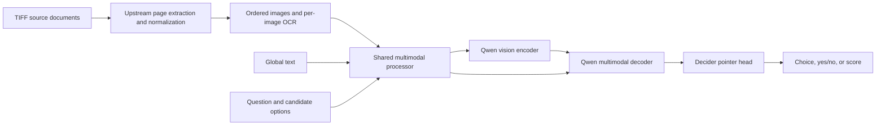

# Multi-image vision support for Strands Decider

Date: 2026-10-02

Status: proposed specification for review. The user selected the full Qwen
multimodal backbone with a pointer head and required multiple-image support.
The user's source documents are mostly TIFFs; conversion happens upstream before
images reach Decider.
This document does not describe implemented or qualified functionality.

## Intended outcome and scope

Extend Decider so one request can contain an ordered group of images, optional
text, and multiple choice, yes/no, or score questions. Each question produces a
decision informed by the whole image group. Multiple images are joint context,
not a batch of unrelated classification requests.

The initial use case is document pages delivered as normalized single-image PNG
or JPEG inputs. The upstream ingestion pipeline decodes TIFF containers and
selects their pages. Images can represent complete pages or crops, with
caller-supplied identifiers, source-document identifiers, page numbers, and OCR text.
Document-level labels are possible by asking about the group. Page-specific
labels are possible by asking separate questions referring to image identifiers.
There is no automatic page-to-document aggregation rule in the first release.

Text-only requests and existing v19 checkpoints retain their current behavior.
The first vision implementation uses complete, uncached multimodal forwards;
shared-prefix caching is a subsequent optimization. TIFF conversion and page
extraction, PDF rendering, video inputs,
OCR generation, automatic page selection, and hierarchical taxonomy routing are
outside this implementation. Callers supply the selected images and questions.

## Architecture



Use `Qwen/Qwen3.5-2B-Base` initially and load its full multimodal backbone with
`Qwen3_5Model`, using the full configuration and `AutoProcessor`. Return the
decoder's final hidden states directly; do not compute vocabulary logits or call
generation. The pointer head continues to score each option from its own final
token and the final answer position.

The existing text path deliberately loads `Qwen3_5ForCausalLM` with the text
configuration. Retain that path for legacy checkpoints. Add a serialized
`input_mode` with `text` and `multimodal` values; missing values mean `text` for
legacy checkpoints. A text checkpoint rejects image requests explicitly.

Scope LoRA to the decoder's existing attention, recurrent, and MLP targets. Do
not accidentally adapt the vision encoder through broad module-name matching.
Read hidden size from the full configuration's text configuration. Confirm
adapter parameter names and weight mapping when testing any v19 initialization;
matching dimensions alone does not prove checkpoint compatibility.

## Request and CLI contract

Retain `POST /v1/systemone` and its existing question and answer types. Extend
requests with an optional `images` list, defaulting to an empty list. Keep `state`
as the existing string or structured text content. An empty string is permitted
only when at least one valid image is provided. Missing `state` retains its
existing validation behavior; image-only callers send `"state": ""`.

Each HTTP image entry represents exactly one already converted page or crop:

- `id`: a nonempty identifier unique within the request.
- `mime_type`: `image/png` or `image/jpeg`.
- `data_base64`: encoded image bytes.
- `source_id`: optional identifier of the original source document.
- `page_number`: optional positive original page number, starting at one.
- `text`: optional OCR or other text associated with this image.

List order is authoritative. Do not sort by page number or identifier. Original
page numbers need not be consecutive: the caller may select pages 1, 4, and 9.
Preserve duplicate image content with distinct identifiers. Validate every image
before inference; an invalid member fails the whole request rather than being
skipped. Return HTTP 422 for malformed inputs or model-token-budget violations,
and 413 for transport or decoded-payload size violations.

Example request, with schematic image bytes:

```json
{
  "state": "Classify this document using both pages.",
  "images": [
    {"id": "doc-1-page-1", "source_id": "doc-1", "page_number": 1, "mime_type": "image/png", "data_base64": "<converted page-1 bytes>"},
    {"id": "doc-1-page-2", "source_id": "doc-1", "page_number": 2, "mime_type": "image/png", "data_base64": "<converted page-2 bytes>"}
  ],
  "questions": {
    "document_type": {
      "type": "choice",
      "instructions": "Which document type best matches the entire group?",
      "criteria": {"invoice": "Billing invoice", "contract": "Agreement between parties"}
    }
  }
}
```

Add a repeatable `--image` CLI option, preserving argument order and assigning
identifiers `image-1`, `image-2`, and so on. Local files are decoded by the CLI;
HTTP requests contain bytes rather than server-local file paths. Permit omission
of `--state` when images are present. The initial HTTP contract does not fetch
remote image URLs. Client image loading and server decoding converge on the same
internal image-group representation.

Proposed usage, after implementation and visual checkpoint training:

```bash
strands-decider ask /path/to/vision-checkpoint \
  --image page-1.png --image page-2.png --image page-3.png \
  --choice "What type of document is this?=invoice,contract,other"

strands-decider ask /path/to/vision-checkpoint \
  --image first-document-page.png --image second-document-page.png \
  --noul "Do these documents concern the same customer?"
```

## Upstream conversion boundary

The upstream ingestion pipeline owns TIFF decoding, multipage expansion, page
selection, orientation correction, photometric interpretation, and bit-depth
normalization. It supplies an ordered list of standalone images rather than a
TIFF container, contact sheet, or image collage. Prefer lossless PNG for scanned
pages; JPEG is also accepted. Deliver 8-bit RGB page images with transparency
resolved upstream. Decider validates the decoded format and RGB pixel mode.

Preserve stable image identifiers, source-document identifiers, original page
numbers, and optional page-specific OCR. Source hashes and conversion settings
belong in the dataset/ingestion provenance manifest. Original TIFF identifiers
do not imply that Decider can read the original files.

Use the same upstream conversion policy for training and serving. Decider still
owns Qwen-specific resizing, patch/token construction, and multimodal tensor
preparation. Avoid upstream resizing to a fixed thumbnail that irreversibly
removes small document text before the processor sees it.

Decider rejects TIFF containers and other unsupported encoded formats with a
clear instruction to provide converted page images. Image-count limits apply to
the supplied page images across all source documents. Over-limit groups fail
explicitly; the caller selects a smaller group upstream. Do not silently discard
later images. No native TIFF codec or frame-selection CLI is added to Decider.

Existing answer semantics remain: `noul` returns its probability, while choice
and score retain their current confidence fields. Do not add a fictitious
confidence field to yes/no results. Multiple questions reuse the request's image
group semantically, even when the initial implementation repeats decoder work.

## Shared preprocessing and token budgets

Create one preparation implementation used by the training collator and inference.
It produces processor tensors, ordered image metadata, option token positions,
and the answer position. Associate image identifiers, page numbers, and per-image
OCR with each corresponding image segment before the question and option suffix.
Include source identifiers and original page numbers when provided. Global `state`
text precedes the image segments. Preserve this order in checkpoint prompt-format
metadata. Source hashes and conversion details remain provenance, not automatically
rendered model features.

Use the official processor to construct image placeholders, pixels, image grids,
and modality metadata. Keep Qwen's multimodal rotary position handling intact.
Do not stringify image dictionaries into ordinary text or manually invent patch
embeddings. Reuse Decider's question/option renderer and do not introduce a chat
template change on the legacy text path.

Find option and answer positions in the final processor-expanded sequence.
Produce a verified mapping from rendered option spans to final token indices;
unexpanded text offsets are insufficient. Reject missing or ambiguous mappings.
Test this with variable image resolutions and counts, right padding, repeated
option wording, and option permutations.

All multimodal checkpoints must declare positive values for `max_images`,
`max_visual_tokens_per_image`, `max_total_visual_tokens`, and `max_length`.
These values are mandatory configuration, not inferred from available GPU memory.
The serving configuration also declares byte and decoded-image-pixel limits.
Exact profiles are recorded when qualifying a checkpoint on target hardware;
the specification makes no unmeasured image-count or memory-capacity claim.

The processor resizes each image deterministically within its configured budget,
preserving aspect ratio. Count actual visual tokens after processing. If the
aggregate visual or complete sequence budget is exceeded, reject the request with
actual and allowed counts. Do not silently drop pages, crop image-token sequences,
or truncate option/answer tokens. The initial multimodal path rejects overlength
text rather than silently changing the evidence. Training follows the same rule.

## Training and datasets

Extend training examples with an ordered list of image assets and their metadata.
JSONL records reference asset paths relative to the manifest directory, with file
hashes and original source/page metadata for provenance. Assets are already converted
PNG/JPEG pages. Resolve references during dataset loading and retain image
group membership; never treat a flattened image list as interchangeable across
examples. Existing text JSONL remains readable without modification.

Start with the pretrained vision encoder frozen and train decoder LoRA plus the
pointer head in fp32. Use choice option permutation and existing ordinal score
handling. Train on both single-image and multiple-image examples, including tasks
that require evidence from more than one page. Mix text-only examples to measure
and limit language-task regression. OCR is optional at training and serving time;
image-only examples must not become empty-text fallback examples.

Keep the existing text reference-KL behavior on text examples where applicable.
The first visual training recipe explicitly disables the text-only reference-KL
and legacy teacher/replay targets on visual rows. A later multimodal teacher is a
separate experiment. Report objective coverage by modality so disabled terms are
visible, and preserve supervised labels, weights, and shuffled label mapping.

Split training, calibration, and evaluation by document/source group. All pages,
crops, and related variants of a document stay in the same split. Establish an
explicit dataset manifest and preregister the visual training experiment before
running it, following CONTRIBUTING.md and research/preregistrations/README.md.

Recalibrate the new checkpoint on held-out visual examples, retaining per-question
type temperatures. Report calibration by image-count range as well. Existing v19
calibration and published confidence thresholds are not evidence for the visual
checkpoint. Selection of an operating threshold follows the measured results.

## Inference, batching, and checkpoint artifacts

Initially bypass shared-prefix caching for requests containing images. Keep legacy
text caching unchanged. Process one question at a time for the initial vision path;
training batches must still handle different image counts without crossing example
boundaries. Optimize batching and image-feature reuse after correctness gates pass.

Any future shared-prefix cache must preserve image grids, multimodal positions,
and independent hybrid recurrent state for each question. Its acceptance gate is
probability agreement with the uncached path across varying image counts and sizes.

Save the full processor, pointer head, decoder adapter, input mode, prompt format,
budget configuration, calibration, and immutable base-model revision. The frozen
vision encoder is reconstructed from that pinned base revision. If vision weights
are later trained, they become required saved artifacts. Update export/verification
to check these requirements without modifying old text exports.

Extend health/capability information with input mode and effective image/token
limits. Account for processed visual tokens in usage and document accounting for
repeated uncached question forwards. Benchmarks report preprocessing time, total
latency, image counts, token counts, and peak GPU memory separately.

## Validation and release gates

- Existing text-checkpoint loading, API behavior, and relevant text tests pass.
- Image-only, image-plus-text, and multiple-image requests work through CLI and HTTP,
  using normalized PNG/JPEG pages from single-page and multipage source documents.
- TIFF payloads are rejected at the Decider boundary. Integration fixtures contain
  upstream-converted pages, retain original source/page associations, and cover
  mixed sizes, selected nonconsecutive pages, and multiple original documents.
- Ordered identifiers, image grids, and pixels remain associated across variable-count
  training batches; malformed images fail the request without partial answers.
- Pointer gathering selects the intended option and answer tokens after visual
  expansion, padding, and permutations; over-budget requests fail explicitly.
- A tiny supervised visual dataset can be overfit to demonstrate that gradients
  reach the intended adapters and head, while the frozen vision encoder stays frozen.
- Held-out tasks requiring two or more images outperform their missing-evidence
  controls; unrelated-page substitution and image removal expose visual dependence.
- Evaluate image-only, OCR-only, and combined inputs with document-separated splits.
  Publish accuracy, calibration, text regression, latency, and memory, without
  treating an infrastructure smoke test as model-quality qualification.
- Save/reload preserves processed inputs and predictions within declared numerical
  tolerance. Export verification validates processor, revisions, and model artifacts.
- Qualify configured image-count and resolution profiles on actual hardware before
  advertising those profiles as supported production capacity.

## Implementation boundaries and sequence

Expected changes: `schema.py`, `cli.py`, `server.py`, `modeling.py`, `prompting.py`,
`infer.py`, `data/format.py`, `data/collate.py`, `train.py`, evaluation/calibration,
`hf_export.py`, vision dependencies in `pyproject.toml`, and focused tests. Add a shared multimodal-preparation module and a
separate visual experiment configuration. Preserve the published v19 recipe and
unrelated local changes, including installation documentation and start scripts.

Sequence: input contract and deterministic preparation; multimodal backbone and
pointer indexing; uncached CLI/API inference; training and checkpoint artifacts;
visual experiment and calibration; capacity qualification; cache optimizations.
Runtime scaffolding alone is not completion of the visual model.

This specification is the review artifact. A detailed implementation plan follows
written-spec approval. Implementation and visual training have not started.

## Sources

- [Current text-only loader](../../../src/strands_decider/modeling.py).
- [Current API schema](../../../src/strands_decider/schema.py).
- [Current training collator](../../../src/strands_decider/data/collate.py).
- [Qwen3.5 model and multimodal forward documentation](https://huggingface.co/docs/transformers/model_doc/qwen3_5).
- [Transformers processor documentation](https://huggingface.co/docs/transformers/main_classes/processors).
- [Project contribution and experiment rules](../../../CONTRIBUTING.md#experiments).
